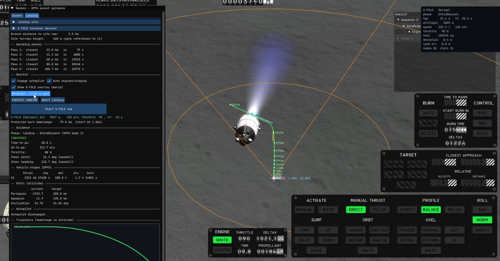

# Powered Guidance

Guidance for [Kitten Space Agency](https://ahwoo.com/app/100000/kitten-space-agency)
(KSA): guidance for powered ascent and powered descent, allowing accurate orbit targeting and pinpoint landing.

## Unified Powered Flight Guidance



The UPFG program is the program that was used to guide the space shuttle to it's desired orbit, as well as providing
capability for other orbital manoeuvres. The implementation of mode 1 (standard ascent) is explained extremely well
by the wonderful PEGAS mod for KSP https://github.com/Noiredd/PEGAS-MATLAB/blob/master/docs/upfg.md

This mod iterates by including mode 2 from the UPFG paper "Ascent to Reference trajectory", which allows us to drive the 
cutoff position to a desired point by modulating throttle. This can not only be used to target a reference trajectory on launch,
 but also to fly the vehicle to a precise landing point.

https://youtu.be/oTMbm27fYgk

## G-FOLD and Lossless Convexification


For the terminal landing, we use JPL's G-FOLD Algorithm developed by Blackmore et al. http://larsblackmore.com/iee_tcst13.pdf

This provides fuel optimal landing at a designated point, subject to constraints on min and max thrust, thrust pointing, glideslope and 
maximum speed. This is achieved by formulating a second-order cone problem, and solving it  multiple times a second to
provide a constantly updating solution which is able to cope with disturbances and modelling uncertainties.

The thrust direction and magnitude
are fed to KSA's autopilot as a euler angle command and a throttle. Therefore, the solver can fail when rapid changes of direction
are required, as the 6dof dynamics are not accounted for. For this reason, it will likely provide better results with an agile lander using 
rcs for pointing, rather than the large default rocket with a large coupling between thrust and control rate due to thrust gimballing.

## Installation

1. Install [StarMap](https://github.com/StarMapLoader/StarMap).
2. Download the latest release from the [Releases](https://github.com/Maximilian-Nesslauer/KSA-AdvancedFlightComputer/releases) tab.
3. Extract into `Documents\My Games\Kitten Space Agency\mods\PoweredGuidance\`.
4. The game auto-discovers new mods and prompts you to enable them. Alternatively, add to `Documents\My Games\Kitten Space Agency\manifest.toml`:

```toml
[[mods]]
id = "PoweredGuidance"
enabled = true
```

## Dependencies

| Package | Purpose | Tested version |
| --- | --- | --- |
| [StarMap](https://github.com/StarMapLoader/StarMap) | Mod loader, required at runtime (see [Installation](#installation)) | 0.4.5 |

## Build dependencies

Required only to build the mod from source. Targets **.NET 10**.

| Package | Source | Tested Version |
| --- | --- | --- |
| [StarMap.API](https://github.com/StarMapLoader/StarMap) | NuGet | 0.3.6 |
| [Lib.Harmony](https://www.nuget.org/packages/Lib.Harmony) | NuGet | 2.4.2 |

## License

GPLv3 — see [`LICENSE`](LICENSE). This is required because the mod links the vendored
ECOS solver, which is GPLv3; the whole work is therefore distributed under GPLv3.

## Credits

- [ECOS](https://github.com/embotech/ecos) (embotech) — the conic solver, GPLv3.
- [PEGAS](https://github.com/Noiredd/PEGAS) by Noiredd — reference and foundation for
  the UPFG implementation.
- G-FOLD — Açıkmeşe & Blackmore, lossless convexification of powered-descent guidance.
